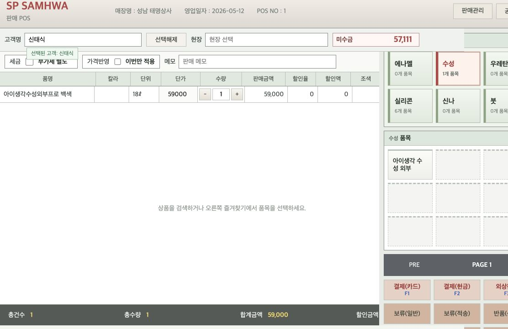
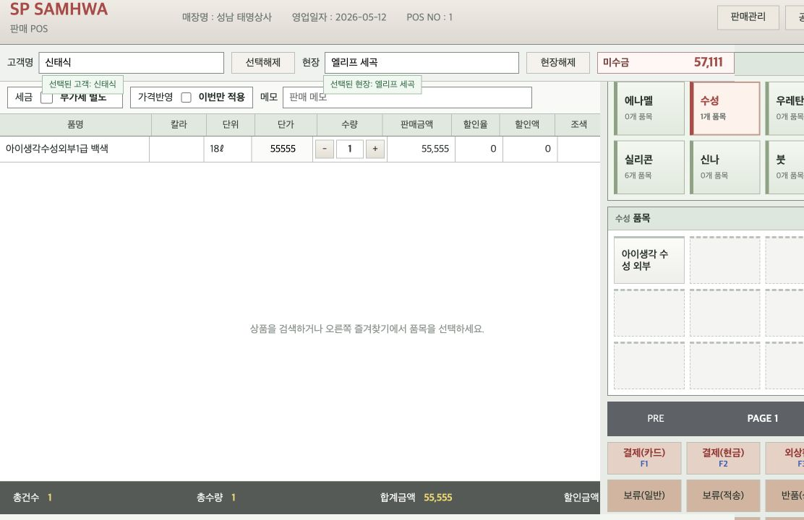
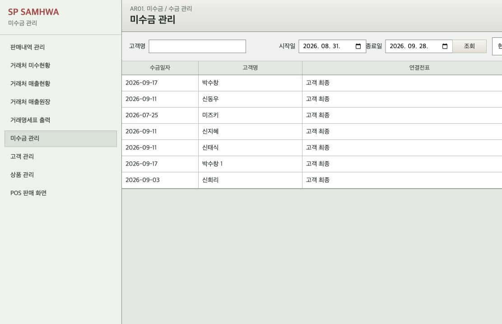
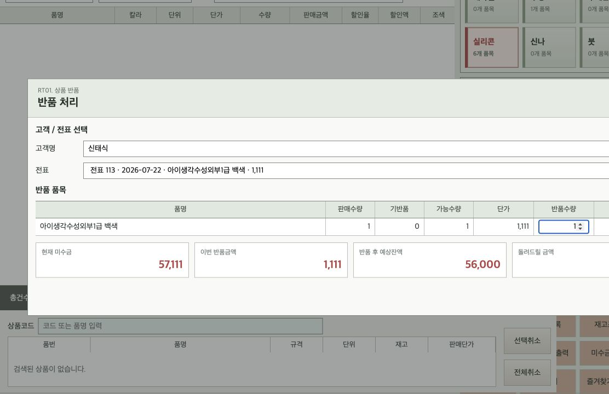
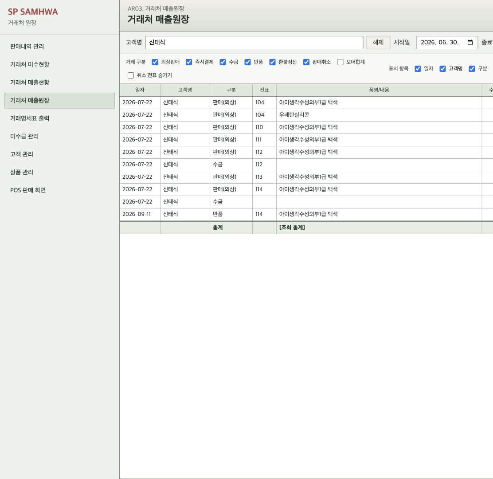
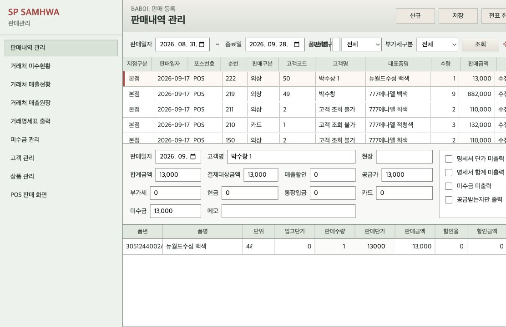

# SMH POS System

An operations-focused point-of-sale and accounts-receivable system for paint and construction-supply retailers.

SMH POS is built around a workflow that ordinary checkout software often misses: the same product may be sold at a different price to each customer and even at a different price for each job site. Many sales are made on credit, payments arrive later, and partial returns must remain traceable to the original invoice. The application keeps those events connected so that the checkout screen, sales records, customer balance, and ledger tell the same story.

> The screenshots below were captured from a local development database. The application UI is currently Korean because it is designed for day-to-day use in a Korean retail store.

## The Checkout Desk



The POS screen keeps the full sales workflow in one workspace. Staff can search products by code or name, use category favorites, edit unit prices and quantities directly, and complete a card, cash, or credit sale without moving between pages. Leaving the customer field empty uses the store's general walk-in customer, while selecting a registered customer brings their outstanding balance and pricing history into the transaction.

The screen is deliberately dense. It is intended for repeated keyboard and mouse use at a counter, so totals, inventory context, payment actions, and shortcuts stay visible together.

## Pricing That Remembers the Customer and the Site



Contract pricing is not treated as a discount attached to a single receipt. A remembered price belongs to a customer, a product, and optionally a job site. In the example above, selecting the customer and the `엘리프 세곡` site loads the previously agreed unit price of `55,555` for the product.

The price resolution order is explicit:

1. A unit price entered for the current line
2. A saved customer + job-site price
3. A saved customer default price
4. The product's standard sale price

Edited prices are saved back to the relevant customer or job site by default. The **one-time only** option applies an exception to the current sale without changing the remembered price.

## Receivables as an Operational View



The receivables page answers two different questions without mixing them together. With no customer selected, it shows the final outstanding balance for every customer and the combined receivable total. Selecting a customer switches the page to that customer's payment history and allows a receipt to be linked to a specific sales order or applied across the customer account.

Overpayments are rejected at the service layer. This keeps the displayed balance from becoming negative because of an accidental payment entry, while returns and cancellations follow their own explicit accounting rules.

## Returns Before They Touch the Ledger



Returns begin from the **Return Product** action in the POS. The operator selects a customer and the original credit-sale invoice, then enters a return quantity for each eligible line. Before anything is saved, the modal shows:

- the original sale quantity
- quantity already returned
- quantity still eligible for return
- the current customer balance
- the value of this return
- the projected balance after the return
- any amount that must be physically returned to the customer

The backend rejects non-positive quantities and cumulative returns greater than the original sale quantity. A successful return increments the item's returned quantity and records a `RETURN` event against the original order.

## One Ledger for Sales, Payments, Returns, and Cancellations



The customer ledger reconstructs the balance over time instead of presenting unrelated reports. Credit sales increase receivables, payments and returns reduce them, and invoice cancellation is recorded as a reversing event. The running balance starts with transactions before the selected date range, so narrowing the period does not reset the customer's financial history.

Operators can filter transaction types, choose visible columns, hide all rows related to cancelled invoices, and export the visible ledger to Word or a Hangul-compatible document. A final total row summarizes the same rows currently shown on screen.

The core receivable events use a signed `ArTx` model:

| Event | `ArTx` type | Balance effect |
| --- | --- | ---: |
| Credit sale | `SALE` | Increases receivables |
| Payment received | `PAYMENT` | Decreases receivables |
| Product return | `RETURN` | Decreases receivables |
| Invoice cancellation | `SALE_CANCEL` | Reverses the remaining sale balance |
| Cancellation refund settlement | `REFUND_SETTLEMENT` | Restores the balance after money is returned |

## Correcting a Sale Without Losing Its History



The sales-management page provides a controlled correction path after checkout. A selected invoice exposes its header totals and line items, including quantity and unit price, while the service layer recalculates supply amount, tax, payment target, and receivables impact.

Invoices can also be cancelled through a preview-first workflow. The preview calculates the remaining sale amount, linked payments, returns, expected customer refund, and final balance before the cancellation is accepted. Instead of deleting history, cancellation deactivates the order and creates the corresponding reversal entries, allowing the ledger to explain what happened later.

## Business Invariants

The application is designed around a small set of rules that are enforced in services rather than only in the browser:

- A return can never exceed the quantity originally sold.
- A payment can never exceed the customer's current receivable balance.
- A remembered unit price is scoped to either the customer or the customer + job site.
- Editing a sale recalculates order totals and the related receivable movement together.
- Cancelling an invoice is an auditable reversal, not an unexplained hard delete.
- Cancelled invoices can be hidden from the working ledger without removing their accounting history.

## Architecture

```text
Thymeleaf + Vanilla JavaScript UI
                |
        Spring MVC controllers
                |
   Transactional domain services
                |
        Spring Data JPA
                |
              H2
```

The main service boundaries mirror the business operations:

| Service | Responsibility |
| --- | --- |
| `SalesOrderService` | Creates sales, resolves prices, stores customer/site prices, and records payment or receivable effects |
| `SalesOrderUpdateService` | Recalculates editable invoices while preserving ledger consistency |
| `PaymentService` | Validates and records customer receipts |
| `ReturnService` | Validates quantities and creates return ledger events |
| `SalesOrderCancelService` | Previews and applies auditable invoice cancellation |
| `LedgerService` | Builds chronological customer ledgers and running balances |
| `StatementService` / `StatementDocxService` | Produces transaction statements and DOCX output |

## Technology

- Java 17
- Spring Boot 4.0.3
- Spring MVC and Thymeleaf
- Spring Data JPA
- H2 Database
- Apache POI for DOCX generation
- Gradle Wrapper
- Vanilla JavaScript and CSS

## Running Locally

### Prerequisites

- JDK 17
- An H2 TCP server available at the connection configured in `src/main/resources/application.yml`

The current development configuration expects:

```text
jdbc:h2:tcp://localhost/~/samwha
username: samhwa
password: 1234
```

Start the application with the Gradle wrapper:

```bash
./gradlew bootRun
```

Then open:

```text
http://localhost:8080/pos
```

The management pages are available at:

```text
/sales-management
/ar-management
/ar-ledger
```

## Tests

Run the complete test suite with:

```bash
./gradlew test
```

The tests cover repository behavior and the main accounting policies, including price precedence, sale creation, payments, partial returns, sale updates, cancellation scenarios, ledger balances, and document generation.

## Project Layout

```text
src/main/java/samosa_fos/de/
  controller/    HTTP and page endpoints
  domain/        JPA entities
  dto/           Request and response contracts
  repository/    Spring Data repositories
  service/       Transaction and accounting rules

src/main/resources/
  templates/     Thymeleaf pages
  static/        POS and management UI assets
  application.yml

src/test/java/samosa_fos/de/
  controller/
  repository/
  service/
```

## Current Scope

This repository is a focused store-operations application rather than a general-purpose SaaS product. Authentication, multi-store tenancy, external payment-gateway integration, and production database deployment are outside the current scope. The present implementation concentrates on making sales, customer-specific pricing, receivables, returns, corrections, and ledger history behave consistently on a single-store workflow.
